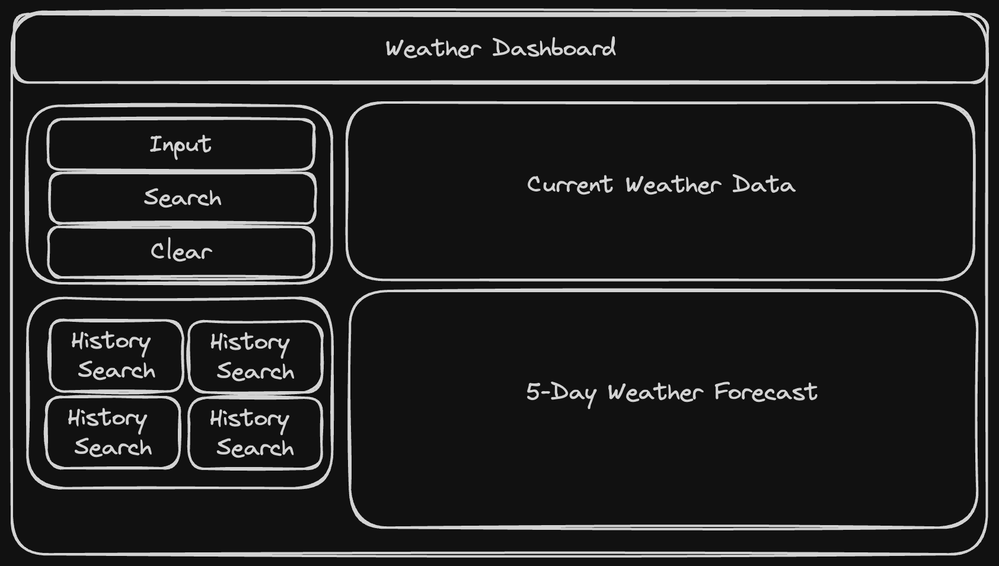

# Weather Dashboard

## User Story
AS A traveler
I WANT to see the weather outlook for multiple cities
SO THAT I can plan a trip accordingly

## Acceptance Criteria

GIVEN a weather dashboard with form inputs:

- WHEN I search for a city THEN I am presented with current and future conditions for that city and that city is added to the search history
- WHEN I view current weather conditions for that city THEN I am presented with the city name, the date, an icon representation of weather conditions, the temperature, the humidity, and the the wind speed
- WHEN I view future weather conditions for that city THEN I am presented with a 5-day forecast that displays the date, an icon representation of weather conditions, the temperature, the wind speed, and the humidity
- WHEN I click on a city in the search history THEN I am again presented with current and future conditions for that city

## Wireframing
- The weather dashboard will have an input box where the user can search for different cities as well as a clear history button. The data will display as current weather and a 5-day forecast. Once the search is completed, the city that the user put in the input will display in the search history.

# HTML
Basic HTML was written to give the page basic elements such as the headers, search card, current weather card, five-day card and search history card. I used the bootstrap grid system to aligm the items within the html. 

# CSS
Minimal CSS was used for this page. I tried to do as much of the styling through the HTML and javascript. 

# Javascript
Psuedocoded for btn, searchApi, printResults, fiveResults, loadSearchHistory and clearLocalStorage.

## Btn Function
This function uses an event listener to start everything. This function in particular stores the value in localStorage, gives an error prompt for an invalid search and pulls the input value into the next function.

## searchAPI Function
This function takes the value from the input and pulls information from an API. The input is first run through an API to get the latitude and longitude by name. This API is called the geocode API from openweather.
Once the latitude and longitude are saved as variable, the value of those variables are saved into the URL to fetch information from another API to get all weather related information.

## printResults and fiveResults Functions
These functions both take the weatherData from the searchAPI function to display the designated information. The information locations chosen to display are saved as variables and console.logged to confirm the correct information is being pulled from the API. 
The printResults function displays the current weather. The fiveResults function runs a for-loop and displays 5 days of weather forecast. 

## loadSearchHistory and clearLocalStorage Functions
The loadSearchHistory function pulls the inputs from the local storage and displays them as buttons. Each button has an event listener to run the text content through the searchAPI function.
The clearLocalStorage function cleans up the page and deletes the local storage of stored inputs.

# Finished Screenshots

 

# Installation

- Clone this repository

* $ git clone git@github.com:schneidsmc/weather-dashboard06.git

# Usage

-Deployed URL

* https://schneidsmc.github.io/weather-dashboard06/

# Author

* [schneidsmc](https://github.com/schneidsmc)

